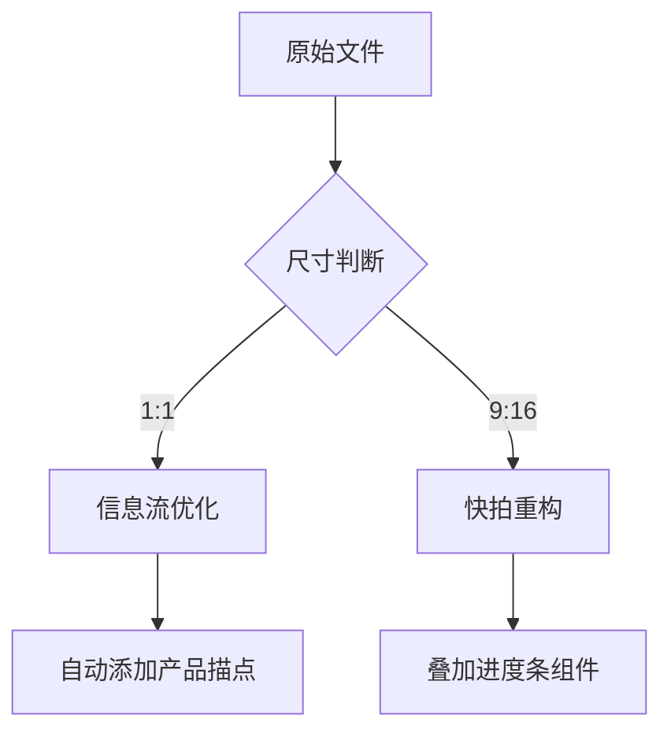

# Facebook广告内容优化的三维战略模型

## 一、版位动态组合矩阵
**1. 跨场景触达体系构建**
- **社交场景**：在Instagram动态投放9:16互动型视频，植入"点击标签生成个人风格报告"功能
- **购物场景**：启用商城搜索结果广告，商品图叠加倒计时模块（如"本小时已售63件"）
- **通讯场景**：在Messenger对话框底部嵌入微缩轮播广告，支持即时询盘

**2. 自适应版位配置方案**
| 产品周期 | 核心版位 | 辅助版位 | 禁忌版位 |
|----------|----------|----------|----------|
| 新品期   | 快拍广告 | 右边栏广告 | 插播视频 |
| 爆品期   | 信息流广告 | Marketplace | 动态产品广告 |
| 长尾期   | 搜索结果广告 | Messenger | 视频插播位 |

## 二、可视化生产流水线
**1. 智能素材生产线**
- **模块化设计平台**：通过Canva建立品牌素材库，预设20套尺寸模板（含1080×1080轮播模板）
- **动态化元素池**：每周从Pexels抓取100张热图，自动生成3组主题色系搭配方案
- **实时质检系统**：植入图像识别插件监测广告元素占比（主图≥65%面积，LOGO<5%）

**2. 多版位自适应技术**

*基于Facebook Ads Manager二次开发的智能适配系统*

## 三、数据驱动的内容进化论
**1. 归因博弈优化矩阵**
- **点击型内容**：采用7天点击归因，侧重优惠券发放类广告
- **浏览型内容**：应用1天展示归因，适配品牌故事类广告
- **混合型策略**：当CPM>$25时启动跨设备归因追踪

**2. 动态迭代沙盒机制**
- 创建3组平行实验组：
  ① 固定主视觉+轮换文案
  ② 固定文案+变异视觉风格
  ③ 全动态组合+AI优选
- 每6小时启动效果诊断：自动暂停CTR低于2%的创意组合

## 四、品牌势能叠加方程式
**1. 视觉锤沉淀法则**
- 恒定元素：在80%广告中保留品牌基准色带（占据画面顶部15%区域）
- 可变元素：每月更新背景粒子动效，保持30%视觉新鲜度
- 彩蛋体系：每季在10%广告中隐藏可收集的虚拟品牌勋章

**2. 信任状植入技术**
- **瞬时信任触发点**：
  - 视频前0.5秒闪现第三方检测报告
  - 图片左下角渐变显示动态购买计数器
  - 文案段末插入可展开的客户视频证言

## 五、自动化运维控制塔
**1. 智能预警系统**
- 建立五维健康指标看板：
  █ 曝光衰减率  █ CTR波动系数  █ 负面反馈指数
  █ 成本变异度  █ 内容疲劳值
- 设置自动响应机制：
  当疲劳值>70%时触发创意库随机组合
  当负面反馈>0.3%时立即推入人工审核

**2. 版位效能驾驶舱**
- **效益热力图**：根据时段动态调整版位预算占比
- **跨屏转化漏斗**：追踪用户从快拍到商城的路径优化
- **版位协同指数**：计算Messenger与信息流广告的互补效应

---

通过构建版位组合矩阵、工业化内容产线、数据沙盒机制与品牌信任体系，广告主能实现从流量收割到资产沉淀的跨跃。关键在于建立具备自我进化能力的智能系统，使每个广告不仅是传播节点，更是数据采集器与策略优化器。当行业普遍陷入素材疲劳困境时，通过"恒定视觉锤+动态内容流"的组合拳，持续激活用户感知，最终实现广告内容从成本中心向利润引擎的质变。```
